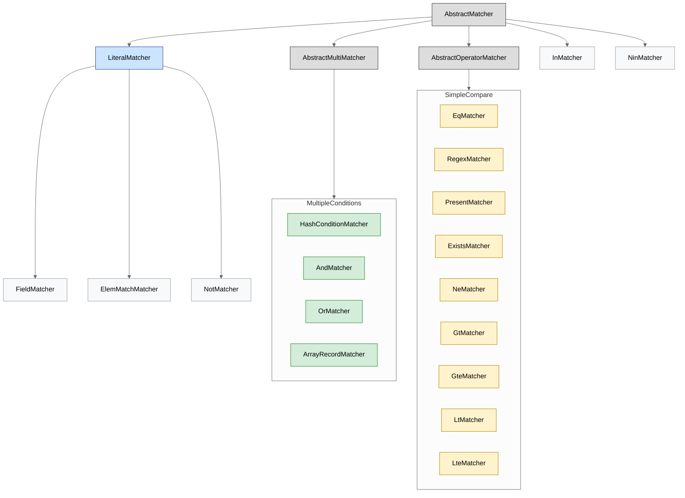

# Matcher classes inheritance diagram

```mermaid
---
config:
  theme: neutral
  look: classic
---

graph TD
  %% style blocks
  classDef abstract fill:#ddd,stroke:#333,stroke-width:1px,color:#000;
  classDef main fill:#cce5ff,stroke:#339,stroke-width:1px;
  classDef multi fill:#d4edda,stroke:#282,stroke-width:1px;
  classDef operator fill:#fff3cd,stroke:#aa8800,stroke-width:1px;
  classDef leaf fill:#f8f9fa,stroke:#999,stroke-width:1px;

  %% Abstract base classes
  A[AbstractMatcher]
  C[AbstractMultiMatcher]
  D[AbstractOperatorMatcher]

  subgraph MultipleConditions
    F[HashConditionMatcher]
    I[AndMatcher]
    J[OrMatcher]
    W[ArrayRecordMatcher]
  end

  subgraph SimpleCompare
    E[EqMatcher]
    K[RegexMatcher]
    L[PresentMatcher]
    M[ExistsMatcher]
    O[NeMatcher]
    Q[GtMatcher]
    R[GteMatcher]
    S[LtMatcher]
    T[LteMatcher]
  end

  A --> B[LiteralMatcher]
  A --> U[InMatcher]
  A --> V[NinMatcher]
  A --> C --> MultipleConditions
  A --> D --> SimpleCompare
  B --> G[FieldMatcher]
  B --> H[ElemMatchMatcher]
  B --> N[NotMatcher]

  %% Apply classes
  class A,C,D abstract;
  class B main;
  class F,I,J,W multi;
  class E,K,L,M,O,Q,R,S,T operator;
  class G,U,V,H,N leaf;
```